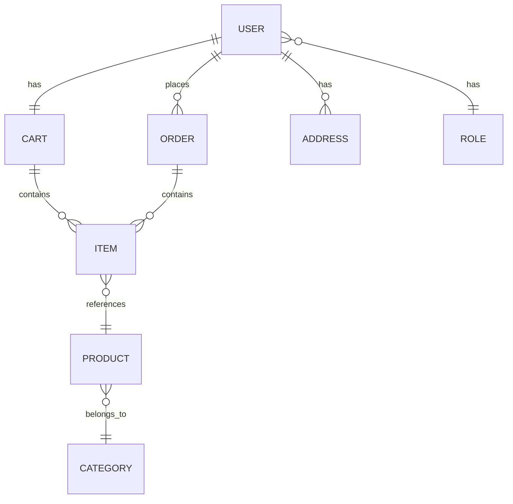

<div align="center">

# 🛒 Nexus E-Commerce

### A Production-Ready E-Commerce Backend API

[](https://spring.io/projects/spring-boot)
[](https://openjdk.org/)
[](https://www.postgresql.org/)
[](https://aws.amazon.com/s3/)

*A robust, scalable RESTful API powering modern e-commerce operations with enterprise-grade security and performance optimizations.*

---

[Features](#-features) • [Architecture](#-architecture) • [Tech Stack](#-tech-stack) • [API Endpoints](#-api-endpoints) • [Getting Started](#-getting-started)

</div>

---

## ✨ Features

<table>
<tr>
<td width="50%">

### 🔐 Security & Authentication
- **JWT-based authentication** with access & refresh tokens
- Role-based access control (RBAC)
- Secure password hashing
- Custom authentication entry points

</td>
<td width="50%">

### 🛍️ E-Commerce Core
- Full product catalog management
- Dynamic category organization
- Shopping cart functionality
- Order processing pipeline

</td>
</tr>
<tr>
<td width="50%">

### ⚡ Performance
- **Caffeine caching** for high-traffic endpoints
- Optimized JPA queries with specifications
- Paginated responses for large datasets
- S3 presigned URLs for efficient media delivery

</td>
<td width="50%">

### 📧 User Experience
- Email verification system
- User profile management
- Address book functionality
- Async email processing

</td>
</tr>
</table>

---

## 🏗️ Architecture

```
┌─────────────────────────────────────────────────────────────────┐
│                         Client Layer                            │
│                    (Web / Mobile / Third-party)                 │
└───────────────────────────────┬─────────────────────────────────┘
                                │
                                ▼
┌─────────────────────────────────────────────────────────────────┐
│                       Security Layer                            │
│              JWT Authentication + Role-Based Access             │
└───────────────────────────────┬─────────────────────────────────┘
                                │
                                ▼
┌─────────────────────────────────────────────────────────────────┐
│                      Controller Layer                           │
│   Auth │ Product │ Category │ Cart │ Order │ User │ Address    │
└───────────────────────────────┬─────────────────────────────────┘
                                │
                                ▼
┌─────────────────────────────────────────────────────────────────┐
│                       Service Layer                             │
│            Business Logic + Caching + Validation                │
└───────────────────────────────┬─────────────────────────────────┘
                                │
                                ▼
┌─────────────────────────────────────────────────────────────────┐
│                     Repository Layer                            │
│                   Spring Data JPA + Specifications              │
└───────────────────────────────┬─────────────────────────────────┘
                                │
              ┌─────────────────┼─────────────────┐
              ▼                 ▼                 ▼
      ┌──────────────┐  ┌──────────────┐  ┌──────────────┐
      │  PostgreSQL  │  │    AWS S3    │  │   Caffeine   │
      │   Database   │  │   Storage    │  │    Cache     │
      └──────────────┘  └──────────────┘  └──────────────┘
```

---

## 🛠️ Tech Stack

| Category | Technologies |
|----------|-------------|
| **Framework** | Spring Boot 4.0.1, Spring Security, Spring Data JPA |
| **Language** | Java 25 |
| **Database** | PostgreSQL with Hibernate ORM |
| **Caching** | Caffeine (in-memory, high-performance) |
| **Cloud** | AWS S3 (presigned URLs for secure uploads/downloads) |
| **Security** | JWT (jjwt 0.13.0), BCrypt password encoding |
| **Email** | Spring Mail with async processing |
| **Build** | Maven |

---

## 📡 API Endpoints

### Authentication
| Method | Endpoint | Description |
|--------|----------|-------------|
| `POST` | `/api/auth/register` | Register new user |
| `POST` | `/api/auth/login` | User login |
| `POST` | `/api/auth/refresh` | Refresh access token |
| `GET` | `/api/auth/verify` | Verify email |

### Products
| Method | Endpoint | Description |
|--------|----------|-------------|
| `GET` | `/api/products` | List products (paginated, filterable) |
| `GET` | `/api/products/{id}` | Get product details |
| `POST` | `/api/products` | Create product (Admin) |
| `PUT` | `/api/products/{id}` | Update product (Admin) |
| `DELETE` | `/api/products/{id}` | Delete product (Admin) |

### Cart & Orders
| Method | Endpoint | Description |
|--------|----------|-------------|
| `GET` | `/api/cart` | Get user's cart |
| `POST` | `/api/cart/items` | Add item to cart |
| `DELETE` | `/api/cart/items/{id}` | Remove from cart |
| `POST` | `/api/orders` | Create order from cart |
| `GET` | `/api/orders` | Get user's orders |

<details>
<summary><b>View all endpoints →</b></summary>

### Categories
| Method | Endpoint | Description |
|--------|----------|-------------|
| `GET` | `/api/categories` | List all categories |
| `POST` | `/api/categories` | Create category (Admin) |

### User Profile
| Method | Endpoint | Description |
|--------|----------|-------------|
| `GET` | `/api/users/me` | Get current user profile |
| `PUT` | `/api/users/me` | Update profile |

### Addresses
| Method | Endpoint | Description |
|--------|----------|-------------|
| `GET` | `/api/addresses` | List user addresses |
| `POST` | `/api/addresses` | Add new address |
| `PUT` | `/api/addresses/{id}` | Update address |
| `DELETE` | `/api/addresses/{id}` | Delete address |

</details>

---

## 🚀 Getting Started

### Prerequisites

- Java 25+
- PostgreSQL 16+
- Maven 3.9+
- AWS Account (for S3)

### Environment Variables

```bash
# Database
DB_USERNAME=your_db_username
DB_PASSWORD=your_db_password

# JWT
JWT_SECRET_KEY=your-256-bit-secret-key

# Email
MAIL_USERNAME=your_email@gmail.com
MAIL_PASSWORD=your_app_password

# AWS S3
AWS_S3_BUCKET=your-bucket-name
AWS_REGION=your-region
AWS_ACCESS_KEY=your-access-key
AWS_SECRET_ACCESS_KEY=your-secret-key
```

### Run Locally

```bash
# Clone the repository
git clone https://github.com/yourusername/nexus-e-commerce.git
cd nexus-e-commerce

# Build the project
./mvnw clean install

# Run the application
./mvnw spring-boot:run
```
---

## 📊 Data Model



---

## 🔒 Security Highlights

- **Stateless JWT authentication** - No server-side session storage
- **Token refresh mechanism** - Seamless user experience with security
- **Role-based permissions** - Granular access control (USER, ADMIN)
- **Input validation** - Jakarta Bean Validation on all DTOs
- **Custom exception handling** - Consistent, secure error responses

---

## 📈 Performance Optimizations

| Feature | Implementation | Benefit |
|---------|---------------|---------|
| **Caching** | Caffeine with 10-min TTL | 90%+ cache hit ratio on products |
| **Lazy Loading** | JPA fetch strategies | Reduced query overhead |
| **Pagination** | Spring Data Pageable | Efficient large dataset handling |
| **Presigned URLs** | AWS S3 SDK | Offload media delivery from API |

---

<div align="center">

## 📬 Contact

**Eiad Loay** - Backend Developer

[](https://linkedin.com/in/yourprofile)
[](https://github.com/yourusername)

---

*Built with ❤️ using Spring Boot*

</div>
